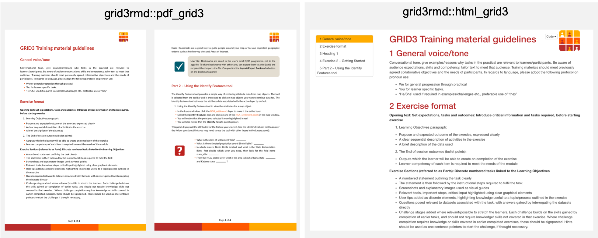
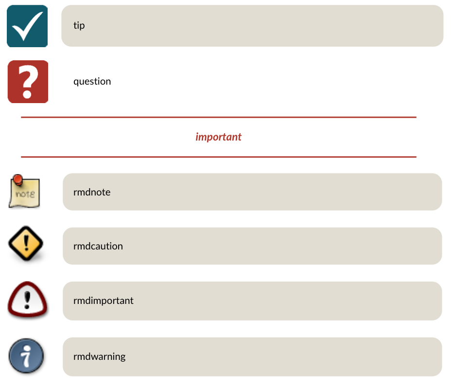

<!-- README.md is generated from README.Rmd. Please edit that file -->


```{r, echo=FALSE, message=FALSE, warning=FALSE}
knitr::opts_chunk$set(
  collapse = TRUE,
  comment = "#>",
  fig.path = "man/figures/README-",
  dpi = 450,
  fig.align = "center",
  out.width = "100%"
)

options(scipen = 999)
```

# grid3rmd 

<!-- badges: start --> 
 [](https://www.tidyverse.org/lifecycle/#stable)
[](https://www.gnu.org/licenses/gpl-3.0)

 <!-- badges: end -->

-----

This R package provides R Markdown templates for the [GRID3](http://grid3.org/) project. These templates provide branded fonts, colour schemes and icons. The package can be installed from GitHub as follows:

```
devtools::install_github("GRID3/grid3rmd")
```

## Using the templates

The template includes output formats for PDF, HTML and Word. These are available through RStudio through `File -> New -> RMarkdown -> From Template`, where `GRID3 Template` and `GRID3 Training Template`, or by changing the output format in the  the YAML of your R Markdown document using the following:

```
output:
  grid3rmd::html_grid3: default
  grid3rmd::pdf_grid3: default
  grid3rmd::word_grid3: default
```

An example of the outputs is shown below:

```{r echo = F}

```

## Custom Blocks

The templates include a range of [custom blocks](https://bookdown.org/yihui/bookdown/custom-blocks.html) which can be used in documents. The options available include **tip**, **question**, **exercise**, **important**, **rmdnote**, **rmdcaution**, **rmdimportant**, **rmdtip**, **rmdwarning**. These are used within code chunks by setting the header as `{block2, type = "tip"}` and including markdown text within the chunk. The full set of options are shown below:

```{r, echo = F}

```

For more examples and demonstrations, users should refer to the [template](https://github.com/GRID3/grid3rmd/blob/master/inst/rmarkdown/templates/gridTraining/skeleton/skeleton.Rmd)


