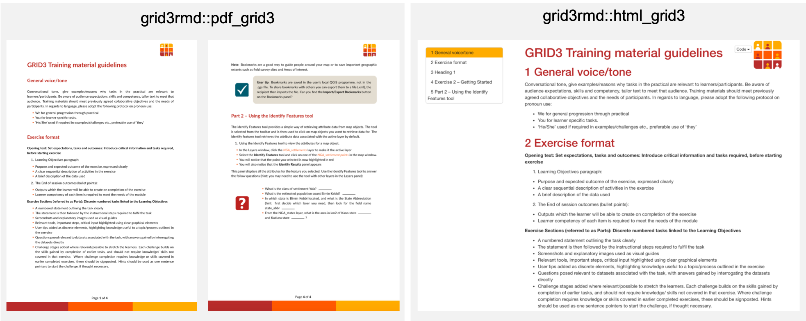

<!-- README.md is generated from README.Rmd. Please edit that file -->

# grid3rmd

-----

This R package contains R Markdown templates for the
[GRID3](http://grid3.org/) project, using brand fonts, colour schemes
and icons. The package can be installed from GitHub as follows:

    devtools::install_github("GRID3/grid3rmd")

## Using the templates

The template includes output formats for PDF, HTML and Word. These are
available through RStudio through `File -> New -> RMarkdown -> From
Template`, where `GRID3 Template` and `GRID3 Training Template`, or by
changing the output format in the the YAML of your R Markdown document
using the following:

    output:
      grid3rmd::html_grid3: default
      grid3rmd::pdf_grid3: default
      grid3rmd::word_grid3: default

An example of the outputs is shown below:

## Custom Blocks

The templates include a range of [custom
blocks](https://bookdown.org/yihui/bookdown/custom-blocks.html) which
can be used in documents. The options available include **tip**,
**question**, **exercise**, **important**, **rmdnote**, **rmdcaution**,
**rmdimportant**, **rmdtip**, **rmdwarning**. These are used within code
chunks by setting the header as `{block2, type = "tip"}` and including
markdown text within the chunk. The full set of options are shown below:

For more examples and demonstrations, users should refer to the
[template](https://github.com/GRID3/grid3rmd/blob/master/inst/rmarkdown/templates/gridTraining/skeleton/skeleton.Rmd)
